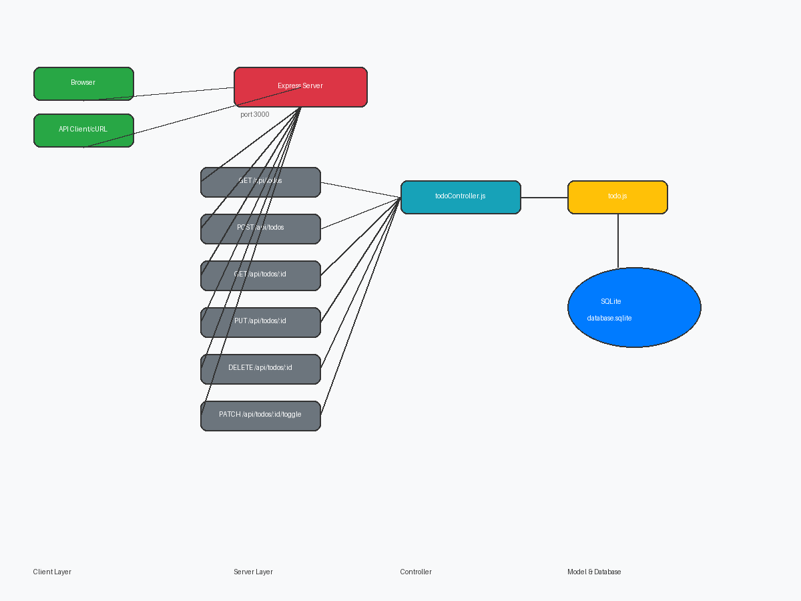
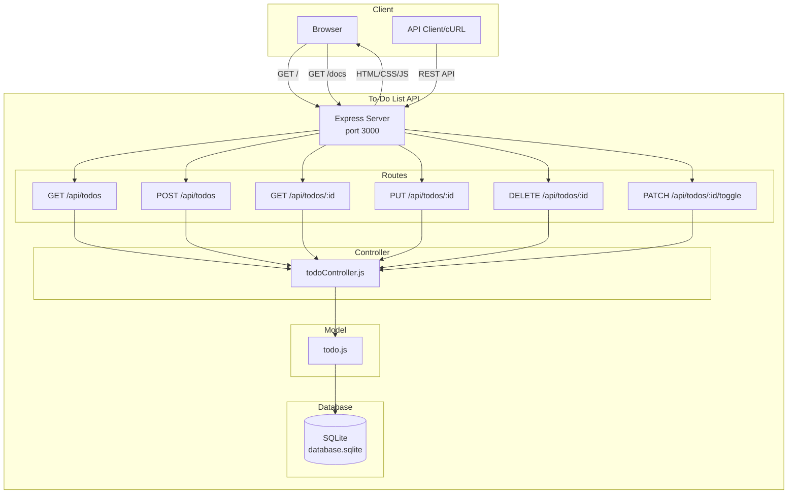

<!-- markdownlint-disable MD013 -->

<p align="center">
  
  
  
  
</p>

<h1 align="center">To-Do List API</h1>

<p align="center">
  A modern RESTful API for managing to-do tasks built with Express.js and SQLite.
  <br>
  <strong><a href="https://github.com/blaxkmiradev">@blaxkmiradev</a></strong> · Made by <strong><a href="https://github.com/Rikixz">Rikixz</a></strong>
</p>

---

## Features

- **CRUD Operations** - Create, Read, Update, and Delete tasks
- **Toggle Completion** - Mark tasks as complete/incomplete
- **RESTful API** - Clean and predictable API endpoints
- **SQLite Database** - Lightweight, zero-configuration database
- **Professional Frontend** - Beautiful web interface
- **API Documentation** - Built-in docs endpoint

---

## Quick Start

```bash
# Clone the repository
git clone https://github.com/blaxkmiradev/To-Do-List-API.git
cd To-Do-List-API

# Install dependencies
npm install

# Start the server
npm start
```

Then open [http://localhost:3000](http://localhost:3000) in your browser.

---

## API Endpoints

| Method | Endpoint | Description | Parameters |
|--------|-----------|-------------|------------|
| `GET` | `/api/todos` | Get all todos | - |
| `GET` | `/api/todos/:id` | Get todo by ID | `id` (URL) |
| `POST` | `/api/todos` | Create new todo | `title` (body), `description` (body) |
| `PUT` | `/api/todos/:id` | Update todo | `id` (URL), body |
| `DELETE` | `/api/todos/:id` | Delete todo | `id` (URL) |
| `PATCH` | `/api/todos/:id/toggle` | Toggle completion | `id` (URL) |

---

## API Documentation

Visit [http://localhost:3000/docs](http://localhost:3000/docs) for full API documentation.

Or fetch via curl:

```bash
curl http://localhost:3000/docs
```

---

## Usage Examples

### Get All Todos

```bash
curl http://localhost:3000/api/todos
```

### Create Todo

```bash
curl -X POST http://localhost:3000/api/todos \
  -H "Content-Type: application/json" \
  -d '{"title": "Learn Node.js", "description": "Study Express.js framework"}'
```

### Update Todo

```bash
curl -X PUT http://localhost:3000/api/todos/1 \
  -H "Content-Type: application/json" \
  -d '{"title": "Learn Node.js", "completed": 1}'
```

### Delete Todo

```bash
curl -X DELETE http://localhost:3000/api/todos/1
```

### Toggle Completion

```bash
curl -X PATCH http://localhost:3000/api/todos/1/toggle
```

---

## Project Structure

```
To-DoListAPI/
├── .env                    # Environment configuration
├── package.json            # Dependencies
├── README.md               # This file
├── public/
│   └── index.html          # Frontend interface
└── src/
    ├── index.js           # Server entry point
    ├── database.js       # SQLite setup
    ├── models/
    │   └── todo.js       # Todo model
    ├── controllers/
    │   └── todoController.js
    └── routes/
        └── todoRoutes.js
```

---

## Architecture Diagram





---

## How It Works

1. **Client Layer**: Users interact via browser (frontend) or API clients (curl, Postman, etc.)
2. **Server Layer**: Express.js handles HTTP requests and routes them to appropriate handlers
3. **Routes**: Direct incoming requests to controller methods based on HTTP method and URL
4. **Controller**: Contains business logic, processes requests, and returns responses
5. **Model**: Handles database operations (CRUD) with SQLite
6. **Database**: SQLite stores all todo data persistently

---

## Configuration

Edit `.env` file to configure the application:

```env
PORT=3000
DB_PATH=./database.sqlite
```

---

## Tech Stack

<p align="left">
  
  
  
  
</p>

---

## License

MIT License · Copyright (c) 2026 [blaxkmiradev](https://github.com/blaxkmiradev)

---

<p align="center">
  <sub>Built with ❤️ by <a href="https://github.com/blaxkmiradev">@blaxkmiradev</a> and <a href="https://github.com/blaxkmiradev">Rikixz</a></sub>
</p>

<!-- markdownlint-enable MD013 -->
